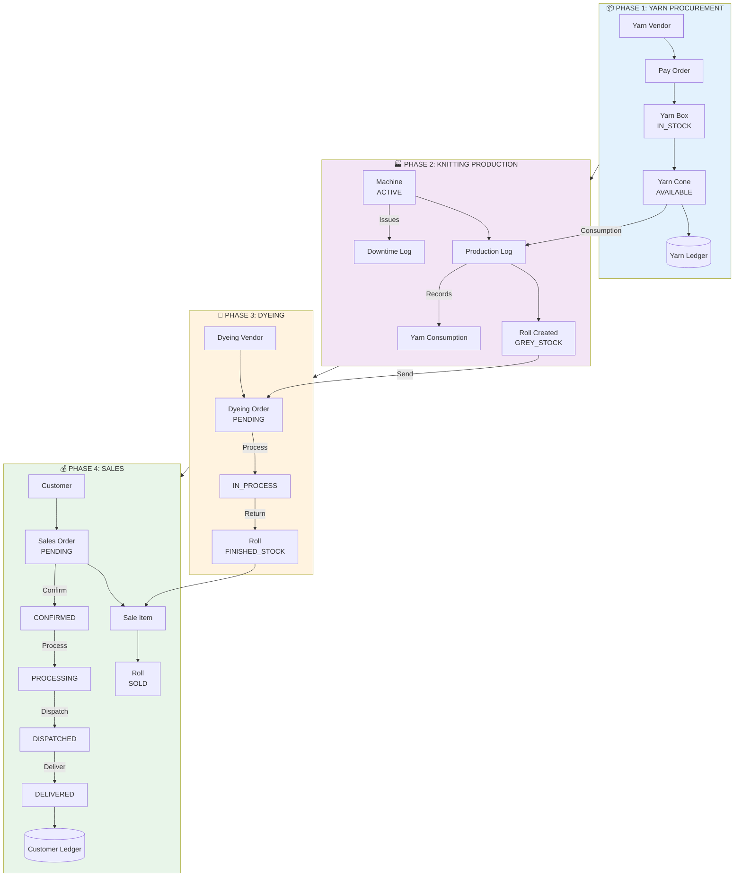
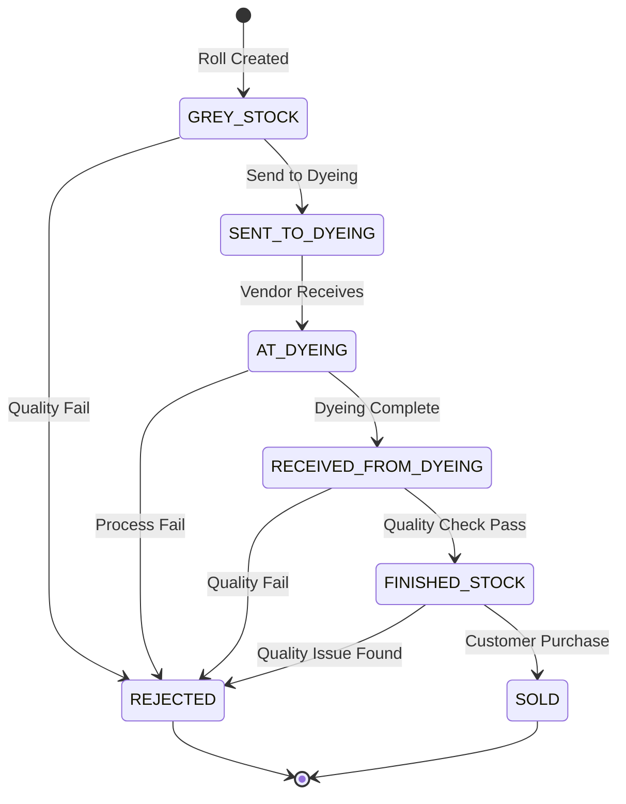

# Mughal Grace - Production Flow Diagram

## Complete Production Lifecycle

```
┌─────────────────────────────────────────────────────────────────────────────────────────────────────────┐
│                                    MUGHAL GRACE - PRODUCTION FLOW                                        │
│                                    Knitting Textile Factory ERP                                          │
└─────────────────────────────────────────────────────────────────────────────────────────────────────────┘

┌─────────────────────────────────────────────────────────────────────────────────────────────────────────┐
│  PHASE 1: YARN PROCUREMENT                                                                               │
├─────────────────────────────────────────────────────────────────────────────────────────────────────────┤
│                                                                                                          │
│  ┌──────────────┐      ┌──────────────┐      ┌──────────────┐      ┌──────────────┐                     │
│  │              │      │              │      │              │      │              │                     │
│  │  YARN VENDOR │─────▶│  PAY ORDER   │─────▶│   YARN BOX   │─────▶│  YARN CONE   │                     │
│  │              │      │  (Purchase)  │      │  (Received)  │      │  (Inventory) │                     │
│  │              │      │              │      │              │      │              │                     │
│  └──────────────┘      └──────────────┘      └──────────────┘      └──────────────┘                     │
│                              │                     │                     │                               │
│                              │                     │                     │                               │
│                              ▼                     ▼                     ▼                               │
│                        ┌───────────┐         ┌───────────┐         ┌───────────┐                        │
│                        │ PENDING   │         │ IN_STOCK  │         │ AVAILABLE │                        │
│                        │ PARTIAL   │         │ PARTIAL   │         │ IN_USE    │                        │
│                        │ COMPLETED │         │ EMPTY     │         │ EMPTY     │                        │
│                        └───────────┘         └───────────┘         └───────────┘                        │
│                                                                                                          │
│  Yarn Ledger: ◄──────────────────────────────────────────────────────────────────────────────────────►  │
│  [Tracks: INWARD, OUTWARD, ADJUSTMENT with running balance]                                              │
│                                                                                                          │
└─────────────────────────────────────────────────────────────────────────────────────────────────────────┘
                                                      │
                                                      │ Yarn Outward / Consumption
                                                      ▼
┌─────────────────────────────────────────────────────────────────────────────────────────────────────────┐
│  PHASE 2: KNITTING PRODUCTION                                                                            │
├─────────────────────────────────────────────────────────────────────────────────────────────────────────┤
│                                                                                                          │
│  ┌──────────────┐      ┌──────────────┐      ┌──────────────┐      ┌──────────────┐                     │
│  │              │      │              │      │              │      │              │                     │
│  │   MACHINE    │─────▶│ PRODUCTION   │─────▶│    YARN      │─────▶│    ROLL      │                     │
│  │  (Knitting)  │      │     LOG      │      │ CONSUMPTION  │      │ (Grey Stock) │                     │
│  │              │      │              │      │              │      │              │                     │
│  └──────────────┘      └──────────────┘      └──────────────┘      └──────────────┘                     │
│        │                     │                                            │                              │
│        │                     │                                            │                              │
│        ▼                     ▼                                            ▼                              │
│  ┌───────────┐         ┌───────────────┐                           ┌───────────┐                        │
│  │ ACTIVE    │         │ • Machine ID  │                           │GREY_STOCK │◄─── Initial Status     │
│  │ MAINTENANCE│        │ • Shift       │                           │           │                        │
│  │ IDLE      │         │ • Date        │                           │ Grade: A/B/C                       │
│  │ DECOMMISSIONED     │ • Target Wt   │                           │ Defects noted                      │
│  └───────────┘         │ • Actual Wt   │                           └───────────┘                        │
│                        │ • Roll Count  │                                                                 │
│  ┌───────────┐         │ • Efficiency  │                                                                 │
│  │ DOWNTIME  │         │ • Operator    │                                                                 │
│  │   LOG     │         └───────────────┘                                                                 │
│  └───────────┘                                                                                           │
│  • Mechanical failure                                                                                    │
│  • Electrical issue                                                                                      │
│  • Yarn breakage                                                                                         │
│  • Needle damage                                                                                         │
│  • Power outage                                                                                          │
│                                                                                                          │
└─────────────────────────────────────────────────────────────────────────────────────────────────────────┘
                                                      │
                                                      │ Rolls sent to Dyeing
                                                      ▼
┌─────────────────────────────────────────────────────────────────────────────────────────────────────────┐
│  PHASE 3: DYEING PROCESS                                                                                 │
├─────────────────────────────────────────────────────────────────────────────────────────────────────────┤
│                                                                                                          │
│  ┌──────────────┐      ┌──────────────┐      ┌──────────────┐      ┌──────────────┐                     │
│  │              │      │              │      │              │      │              │                     │
│  │ DYEING      │◄─────│ DYEING ORDER │─────▶│ DYEING ORDER │─────▶│    ROLL      │                     │
│  │ VENDOR      │      │  (Dispatch)  │      │    ITEM      │      │  (Finished)  │                     │
│  │              │      │              │      │              │      │              │                     │
│  └──────────────┘      └──────────────┘      └──────────────┘      └──────────────┘                     │
│        │                     │                                            │                              │
│        │                     │                                            │                              │
│        ▼                     ▼                                            ▼                              │
│  ┌───────────┐         ┌───────────────┐                                                                │
│  │ • Quality │         │ Order Status: │                           ROLL STATUS FLOW:                    │
│  │   Rating  │         │ ───────────── │                           ─────────────────                    │
│  │ • Turnaround│       │ PENDING       │                                                                │
│  │ • Contact │         │ IN_PROCESS    │     ┌─────────────┐    ┌─────────────┐    ┌─────────────┐      │
│  └───────────┘         │ PARTIAL_RECEIVED   │SENT_TO_DYEING│───▶│ AT_DYEING   │───▶│RECEIVED_FROM│      │
│                        │ COMPLETED    │     │             │    │             │    │   DYEING    │      │
│                        │ CANCELLED    │     └─────────────┘    └─────────────┘    └─────────────┘      │
│                        └───────────────┘                                                │               │
│                                                                                         ▼               │
│  Weight Tracking:                                                              ┌─────────────┐          │
│  • Grey Weight (sent)                                                          │FINISHED_STOCK│         │
│  • Finished Weight (received)                                                  └─────────────┘          │
│  • Weight gain/loss calculation                                                                         │
│                                                                                                          │
└─────────────────────────────────────────────────────────────────────────────────────────────────────────┘
                                                      │
                                                      │ Finished Rolls ready for Sale
                                                      ▼
┌─────────────────────────────────────────────────────────────────────────────────────────────────────────┐
│  PHASE 4: SALES & DELIVERY                                                                               │
├─────────────────────────────────────────────────────────────────────────────────────────────────────────┤
│                                                                                                          │
│  ┌──────────────┐      ┌──────────────┐      ┌──────────────┐      ┌──────────────┐                     │
│  │              │      │              │      │              │      │              │                     │
│  │   CUSTOMER   │◄─────│ SALES ORDER  │─────▶│  SALE ITEM   │─────▶│   ROLL       │                     │
│  │              │      │              │      │   (Lines)    │      │   (SOLD)     │                     │
│  │              │      │              │      │              │      │              │                     │
│  └──────────────┘      └──────────────┘      └──────────────┘      └──────────────┘                     │
│        │                     │                                                                           │
│        │                     │                                                                           │
│        ▼                     ▼                                                                           │
│  ┌───────────┐         ┌───────────────┐                                                                │
│  │ Types:    │         │ Order Status: │                                                                │
│  │ • REGULAR │         │ ───────────── │                                                                │
│  │ • WHOLESALE│        │ PENDING       │                                                                │
│  │ • RETAIL  │         │ CONFIRMED     │                                                                │
│  │ • EXPORT  │         │ PROCESSING    │                                                                │
│  └───────────┘         │ DISPATCHED    │                                                                │
│                        │ DELIVERED     │                                                                │
│                        │ CANCELLED     │                                                                │
│                        └───────────────┘                                                                │
│                                                                                                          │
│  ┌─────────────────────────────────────────────────────────────────────────────────────────────────┐    │
│  │  CUSTOMER LEDGER                                                                                │    │
│  │  ─────────────────────────────────────────────────────────────────────────────────────────────  │    │
│  │  Entry Types: INVOICE (Debit) │ PAYMENT (Credit) │ CREDIT_NOTE │ DEBIT_NOTE                     │    │
│  │  Running Balance: Opening Balance → Transactions → Current Balance                              │    │
│  └─────────────────────────────────────────────────────────────────────────────────────────────────┘    │
│                                                                                                          │
└─────────────────────────────────────────────────────────────────────────────────────────────────────────┘


═══════════════════════════════════════════════════════════════════════════════════════════════════════════
                                    ROLL STATUS LIFECYCLE (Complete)
═══════════════════════════════════════════════════════════════════════════════════════════════════════════

┌────────────┐    ┌────────────────┐    ┌────────────┐    ┌─────────────────────┐    ┌──────────────┐
│            │    │                │    │            │    │                     │    │              │
│ GREY_STOCK │───▶│ SENT_TO_DYEING │───▶│ AT_DYEING  │───▶│ RECEIVED_FROM_DYEING│───▶│FINISHED_STOCK│
│            │    │                │    │            │    │                     │    │              │
└────────────┘    └────────────────┘    └────────────┘    └─────────────────────┘    └──────┬───────┘
     │                                                                                       │
     │                                                                                       │
     │                    ┌────────────────────────────────────────────────────────────────┐ │
     │                    │                                                                │ │
     │                    ▼                                                                ▼ ▼
     │              ┌──────────┐                                                     ┌──────────┐
     └─────────────▶│ REJECTED │◄────────────────────────────────────────────────────│   SOLD   │
                    └──────────┘                                                     └──────────┘
                    (Quality issues)                                                 (Final state)


═══════════════════════════════════════════════════════════════════════════════════════════════════════════
                                         INVENTORY & LEDGER FLOWS
═══════════════════════════════════════════════════════════════════════════════════════════════════════════

YARN INVENTORY:
──────────────────────────────────────────────────────────────────────────────────────────────────────────
PayOrder        │  YarnBox        │  YarnCone         │  YarnLedger          │  YarnConsumption
(Purchase)      │  (Physical)     │  (Unit)           │  (Accounting)        │  (Production)
──────────────────────────────────────────────────────────────────────────────────────────────────────────
Create Order ──▶│  Receive Box ──▶│  Track Cones ────▶│  INWARD Entry ──────▶│  Link to Production
                │  Weight Track   │  Weight Track     │  Balance Update      │  Deduct from Ledger
Update Status  │  Status Track   │  Machine Assign   │                      │  Cone-level Track
                │                 │  Usage Track      │  OUTWARD Entry ◄─────│
──────────────────────────────────────────────────────────────────────────────────────────────────────────


ROLL TRACKING:
──────────────────────────────────────────────────────────────────────────────────────────────────────────
Production      │  Grey Stock     │  Dyeing           │  Finished Stock      │  Sales
──────────────────────────────────────────────────────────────────────────────────────────────────────────
ProductionLog ─▶│  Roll Created ─▶│  DyeingOrder ────▶│  Weight Recorded ───▶│  SaleItem Linked
                │  Grey Weight    │  Grey→Finished    │  Quality Graded      │  Roll Status: SOLD
Machine Link    │  Grade Assigned │  Weight Δ Calc    │  Location Updated    │  Customer Invoice
Roll Count      │  Location       │  Status History   │                      │  Ledger Entry
──────────────────────────────────────────────────────────────────────────────────────────────────────────


FINANCIAL FLOW:
──────────────────────────────────────────────────────────────────────────────────────────────────────────
Payables (Vendors)                           │  Receivables (Customers)
──────────────────────────────────────────────────────────────────────────────────────────────────────────
Yarn Vendor     ──▶ PayOrder ──▶ VendorLedger │  Customer ──▶ SalesOrder ──▶ CustomerLedger
Dyeing Vendor   ──▶ DyeingOrder ──▶ VendorLedger │           ──▶ Invoice    ──▶ AgingAnalysis
                                              │           ──▶ Payment    ──▶ Statement
Payment Track   ◄── Cheque Management         │  Receipt   ◄── Cheque Management
──────────────────────────────────────────────────────────────────────────────────────────────────────────
```

---

## Mermaid Diagram (Interactive)



---

## Roll Status State Machine



---

## Key Metrics at Each Stage

| Phase | Key Metrics | Tracking Entity |
|-------|-------------|-----------------|
| **Procurement** | Order value, Received weight, Payment status | PayOrder, YarnLedger |
| **Production** | Target vs Actual, Efficiency %, Downtime hours | ProductionLog, DowntimeLog |
| **Dyeing** | Turnaround days, Weight loss %, Cost per kg | DyeingOrder |
| **Sales** | Order value, Payment aging, Delivery on-time | SalesOrder, CustomerLedger |

---

## Status Codes Reference

### Pay Order Status
- `PENDING` - Order placed, awaiting delivery
- `PARTIAL` - Some items received
- `COMPLETED` - All items received
- `CANCELLED` - Order cancelled

### Roll Status
- `GREY_STOCK` - Raw roll from production
- `SENT_TO_DYEING` - Dispatched to dyeing vendor
- `AT_DYEING` - Being processed at vendor
- `RECEIVED_FROM_DYEING` - Returned from vendor
- `FINISHED_STOCK` - Ready for sale
- `SOLD` - Sold to customer
- `REJECTED` - Quality issues, not sellable

### Sales Order Status
- `PENDING` - Order created
- `CONFIRMED` - Order confirmed
- `PROCESSING` - Being prepared
- `DISPATCHED` - Shipped to customer
- `DELIVERED` - Received by customer
- `CANCELLED` - Order cancelled
